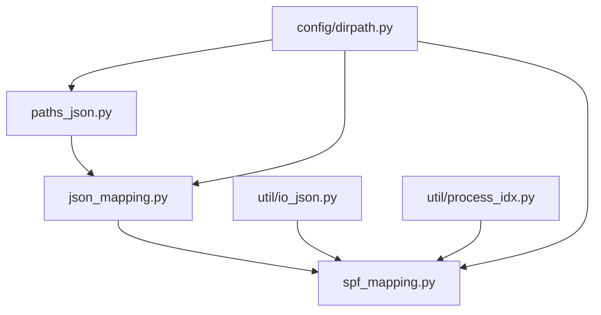

# Scripts ディレクトリ総合評価

## 概要
scriptsディレクトリには、ポケモンデータの処理とマッピング生成を行う3つの主要なPythonスクリプトが含まれています。これらは互いに関連し合い、データパイプラインの重要な部分を構成しています。

## ファイル一覧と役割

| ファイル | 主要機能 | 必要性 | 依存関係 |
|---------|----------|--------|----------|
| `json_mapping.py` | JSONファイルマッピング辞書生成 | 高 | `paths_json.py` |
| `paths_json.py` | ディレクトリ探索・名前検索 | 中〜高 | なし（基盤） |
| `spf_mapping.py` | SPF関係マッピング生成 | 最高 | `json_mapping.py`（間接的） |

## 依存関係図


## 個別評価サマリー

### 1. paths_json.py
- **機能**: ディレクトリ操作ユーティリティ
- **必要性**: ★★★★☆ (中〜高)
- **理由**: 他スクリプトの基盤機能、シンプルだが重要
- **改善点**: エラーハンドリング、キャッシュ機能

### 2. json_mapping.py
- **機能**: JSONファイルマッピング生成
- **必要性**: ★★★★☆ (高)
- **理由**: 大量ファイルの効率的管理、定数生成
- **改善点**: エラーハンドリング、設定可能性向上

### 3. spf_mapping.py
- **機能**: ポケモンSPF関係マッピング
- **必要性**: ★★★★★ (最高)
- **理由**: コアビジネスロジック、システム中核機能
- **改善点**: 並列処理、増分更新、バリデーション

## システム全体での位置づけ

### データフロー
```
Raw JSON Files → paths_json → json_mapping → spf_mapping → Output SPF Map
     ↓              ↓           ↓             ↓              ↓
  ディレクトリ    探索支援    マッピング生成   関係性処理    最終成果物
```

### 重要度ランキング
1. **spf_mapping.py** - システムのコア、削除不可
2. **json_mapping.py** - 効率化の要、削除でシステム影響大
3. **paths_json.py** - 基盤機能、削除で他機能に影響

## 統合的な改善提案

### 1. アーキテクチャ改善
```python
# 統合クラス設計案
class PokeDataProcessor:
    def __init__(self, config: ProcessorConfig):
        self.path_manager = PathManager(config.json_dir)
        self.mapper = JsonMapper(config.output_dir)
        self.spf_processor = SPFProcessor(config.species_range)

    def process_all(self) -> SPFMap:
        # 統合処理パイプライン
        pass
```

### 2. 設定駆動化
```yaml
# processor_config.yaml
data_sources:
  json_dir: "json/"
  output_dir: "meta/"

processing:
  species_range: [1, 1205]
  parallel_workers: 4
  cache_enabled: true

validation:
  strict_mode: true
  missing_file_handling: "warn"
```

### 3. 監視・ログ機能
```python
import logging
from datetime import datetime

class ProcessorMonitor:
    def __init__(self):
        self.logger = logging.getLogger(__name__)
        self.metrics = {}

    def track_performance(self, operation: str, duration: float, items_processed: int):
        # パフォーマンス追跡
        pass
```

## テスト戦略

### 現状のテストカバレッジ
- **paths_json.py**: 基本機能テスト ✅
- **json_mapping.py**: クラスメソッドテスト ✅
- **spf_mapping.py**: モック使用テスト ✅

### 追加推奨テスト
1. **統合テスト**: 3ファイル連携動作
2. **パフォーマンステスト**: 大量データ処理
3. **エラー復旧テスト**: 異常データでの動作
4. **回帰テスト**: データ更新後の一貫性

## リスク分析

### 技術的リスク
| リスク | 影響度 | 発生確率 | 対策 |
|--------|--------|----------|------|
| JSONファイル破損 | 高 | 中 | バリデーション強化 |
| メモリ不足 | 中 | 低 | ストリーミング処理 |
| 処理時間超過 | 中 | 中 | 並列処理、増分更新 |
| 依存関係変更 | 高 | 低 | インターフェース安定化 |

### 運用リスク
| リスク | 影響度 | 発生確率 | 対策 |
|--------|--------|----------|------|
| データ形式変更 | 高 | 中 | バージョン管理 |
| ファイル権限問題 | 中 | 低 | 権限チェック |
| ディスク容量不足 | 中 | 低 | 容量監視 |

## 削除可能性評価

### ❌ **削除不可ファイル**
- **spf_mapping.py**: システムコア機能
  - 削除影響: システム全体停止
  - 代替手段: なし（再実装が必要）

### ⚠️ **要検討ファイル**
- **json_mapping.py**: 効率化機能
  - 削除影響: パフォーマンス劣化、他機能への影響
  - 代替手段: 動的ファイルスキャン（非推奨）

- **paths_json.py**: 基盤機能
  - 削除影響: 他ファイルの修正が必要
  - 代替手段: pathlib直接使用（コード重複）

## 総合結論

### 💎 **全ファイル保持を強く推奨**

#### 理由
1. **システム整合性**: 相互依存関係が確立済み
2. **開発効率**: 既存の動作を保証
3. **保守性**: 明確な責任分離
4. **拡張性**: 将来の機能追加基盤

#### 優先改善項目
1. **エラーハンドリング統一化**（全ファイル）
2. **spf_mapping.pyのパフォーマンス最適化**
3. **統合テストの充実**
4. **設定外部化の検討**

#### 長期ビジョン
- 現在の3ファイル構造を維持
- 段階的な機能強化
- 将来的な統合クラス設計への移行検討
- マイクロサービス化への対応

**結論**: **全てのファイルが必要**。削除ではなく段階的改善を推奨。
