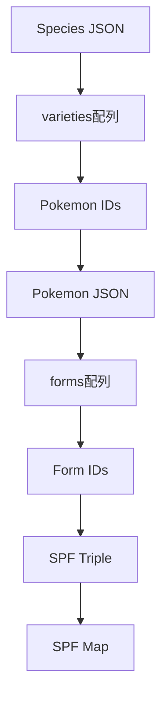

# spf_mapping.py

## 概要
ポケモンの Species（種族）、Pokemon（個体）、Form（フォーム）の関係をマッピングし、SPF（Species-Pokemon-Form）マップを生成するスクリプト。ポケモンデータの階層構造を平坦化し、統一的なアクセス方法を提供。

## 主要機能

### ヘルパー関数

1. **`get_json_files_mapping(subdir: str) -> Dict[str, str]`**
   - **目的**: 指定サブディレクトリのJSONファイルマッピングを動的生成
   - **パラメータ**: `subdir` - JSONディレクトリ内のサブディレクトリ名
   - **戻り値**: `{ファイル名(5桁): ファイル名.json}` の辞書
   - **例**: `{"00001": "00001.json", "00025": "00025.json"}`

### MonsterMap クラス

#### 主要メソッド

1. **`_extract_idx_from_data(entries: List[Dict[str, Any]]) -> List[int]`**
   - **目的**: JSONデータからURL経由でIDを抽出
   - **対応形式**:
     - `{"url": "https://api/pokemon/1/"}` → `[1]`
     - `{"pokemon": {"url": "https://api/pokemon/25/"}}` → `[25]`
     - `{"form": {"url": "https://api/form/10/"}}` → `[10]`

2. **`process_species(species_id: int) -> List[int]`**
   - **目的**: 種族IDから関連ポケモンIDリストを取得
   - **処理**: species JSONの `varieties` フィールドを解析
   - **戻り値**: ポケモンIDのリスト

3. **`process_pokemon(pokemon_ids: List[int]) -> List[int]`**
   - **目的**: ポケモンIDリストから関連フォームIDリストを取得
   - **処理**: 各pokemon JSONの `forms` フィールドを解析
   - **戻り値**: フォームIDのリスト

4. **`process_form(form_ids: List[int]) -> None`**
   - **目的**: フォームIDの存在確認（現在は処理なし）
   - **用途**: 将来的な拡張用プレースホルダー

5. **`process_all(species_ids: List[int]) -> List[Dict[str, int]]`**
   - **目的**: 種族IDリストから完全なSPFトリプルを生成
   - **処理フロー**:
     ```
     Species ID → Pokemon IDs → Form IDs → SPF Triples
     ```
   - **戻り値**: `[{"species": 1, "pokemon": 1, "form": 1}, ...]`

6. **`make_spf_map(triples: List[Dict[str, int]]) -> Dict[str, Dict[str, int]]`**
   - **目的**: SPFトリプルを統一キー形式でマップ化
   - **キー形式**: `m{5桁連番}` (例: `m00001`, `m00002`)
   - **戻り値**: `{"m00001": {"species": 1, "pokemon": 1, "form": 1}}`

## 使用例

### 基本的な使用
```python
from scripts.spf_mapping import MonsterMap

# インスタンス作成
mm = MonsterMap()

# 単一種族の処理
pokemon_ids = mm.process_species(1)  # フシギダネ
form_ids = mm.process_pokemon(pokemon_ids)

# 一括処理
target_species = list(range(1, 152))  # 第1世代
triples = mm.process_all(target_species)
spf_map = MonsterMap.make_spf_map(triples)
```

### モジュール実行
```bash
python -m scripts.spf_mapping
```

## 出力例

### 生成されるSPFマップ（meta/spf_map.py）
```python
SPF_MAP = {
  "m00001": {
    "form": 1,
    "pokemon": 1,
    "species": 1
  },
  "m00002": {
    "form": 2,
    "pokemon": 2,
    "species": 2
  },
  ...
}
```

## データフロー


## 依存関係
- `config.dirpath`: ディレクトリパス定数
- `util.io_json`: JSON読み込み機能
- `util.process_idx`: URL からID抽出

## 用途分析

### 実際の用途
1. **データ統合**: 階層的なポケモンデータの平坦化
2. **高速アクセス**: 統一キーによる効率的データアクセス
3. **関係性マッピング**: Species-Pokemon-Form間の複雑な関係を単純化
4. **API連携**: 外部APIとの統合時のマッピングテーブル

### ビジネス価値
- **データ処理効率化**: 複雑な関係性を事前計算
- **開発生産性**: 統一的なアクセスインターフェース
- **保守性向上**: データ構造変更への耐性

## 必要性評価

#### ✅ **必要性：最高**

**必須理由**:
1. **コアビジネスロジック**: ポケモンデータの中核的変換処理
2. **データアーキテクチャ**: システム全体のデータアクセス基盤
3. **複雑性解決**: 3階層の関係性を効率的に処理
4. **パフォーマンス**: 事前計算によるクエリ高速化

## 技術的課題と改善案

### 現在の課題
1. **エラーハンドリング**: JSONファイル不整合時の処理不足
2. **メモリ使用量**: 全データをメモリに保持
3. **処理時間**: 全species処理時の時間コスト
4. **依存性**: 外部ファイル構造への強い依存

### 改善案

#### 1. 増分処理対応
```python
def process_incremental(self, updated_species: List[int]) -> Dict:
    # 変更された species のみ再処理
    pass
```

#### 2. バリデーション強化
```python
def validate_data_consistency(self) -> List[str]:
    # データ整合性チェック
    # 欠損ファイル、不正リンクの検出
    pass
```

#### 3. 並列処理導入
```python
import concurrent.futures

def process_all_parallel(self, species_ids: List[int]) -> List[Dict]:
    with concurrent.futures.ThreadPoolExecutor() as executor:
        # 並列処理で高速化
        pass
```

#### 4. キャッシュ機能
```python
@functools.lru_cache(maxsize=1000)
def process_species_cached(self, species_id: int) -> List[int]:
    # 結果をキャッシュして高速化
    pass
```

## 代替アーキテクチャ検討

### 1. データベースソリューション
```sql
CREATE TABLE spf_mapping (
    id VARCHAR(10) PRIMARY KEY,
    species_id INT,
    pokemon_id INT,
    form_id INT,
    INDEX(species_id, pokemon_id, form_id)
);
```
**メリット**: 高速クエリ、ACID特性、複雑な検索
**デメリット**: DB依存、セットアップ複雑性

### 2. インメモリデータベース
```python
import sqlite3
# :memory: database for fast access
```
**メリット**: SQL機能、永続化不要
**デメリット**: 起動時間、メモリ使用量

### 3. NoSQLソリューション
```python
# MongoDB/DocumentDB style
{
    "_id": "m00001",
    "species": {"id": 1, "name": "bulbasaur"},
    "pokemon": {"id": 1, "name": "bulbasaur"},
    "forms": [{"id": 1, "name": "default"}]
}
```
**メリット**: 柔軟性、スケーラビリティ
**デメリット**: 外部依存、学習コスト

## パフォーマンス分析

### 現在の計算量
- **時間**: O(S × P × F) - Species × Pokemon × Form
- **空間**: O(S × P × F) - 全組み合わせを保持
- **I/O**: O(S + P + F) - 各JSONファイル1回読み込み

### 実測値（推定）
- **処理対象**: ~1,200 species → ~10,000 SPF combinations
- **処理時間**: ~30-60秒（ファイルI/O依存）
- **メモリ使用量**: ~50-100MB（JSON data + mappings）

## セキュリティ考慮事項
1. **ファイルアクセス**: 読み取り専用、サンドボックス化
2. **入力検証**: species_id範囲チェック
3. **リソース制限**: メモリ、処理時間制限

## 結論

**このファイルは絶対必要**。プロジェクトの中核的なデータ変換機能を担当。

### 重要度評価
- **ビジネス重要度**: ★★★★★
- **技術的複雑度**: ★★★★☆
- **保守性**: ★★★☆☆
- **拡張性**: ★★★☆☆

### 推奨事項
1. **現状維持**: 核心機能として保持必須
2. **段階的改善**: エラーハンドリング → 並列処理 → キャッシュ
3. **監視追加**: 処理時間、メモリ使用量の監視
4. **テスト強化**: 境界値、異常系テストの追加

**削除は不可**: システムアーキテクチャの根幹部分
